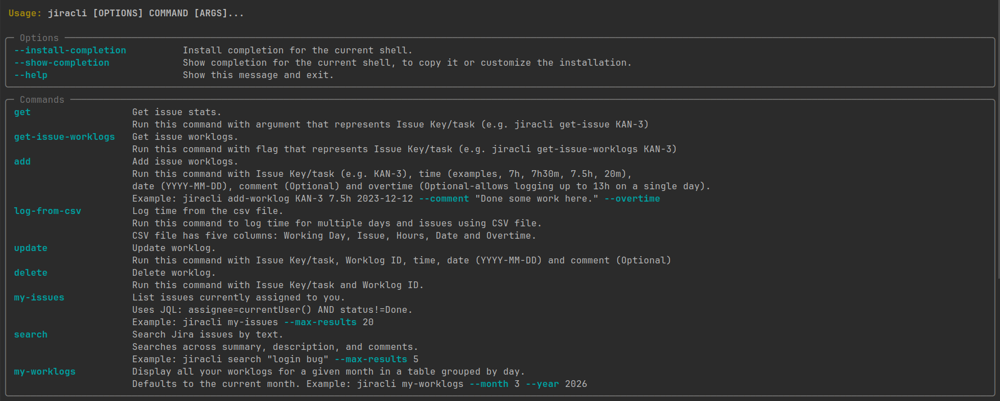

# Jira CLI Tool

This readme describes instructions on how to use Jira CLI tool for logging time.

## Setup

Clone the repository via:
```shell
git clone https://github.com/MicikaS/jira-cli-tool.git
```

## Set up the .env file

`EMAIL`, `JIRA_USERNAME` and `API_KEY` env variables have to be added manually.

Enter your email as a string.
The Jira Username usually consists of your capitalized first and last names separated by a space.
The API_KEY is gotten through your Jira Account Settings. Detailed guidance you can find on this
[link (official documentation)](https://support.atlassian.com/atlassian-account/docs/manage-api-tokens-for-your-atlassian-account/)
```.dotenv
API_KEY="YOUR-SECRET-API-KEY"
EMAIL="john.doe@example.com"  # Represents email you use to log into Jira
JIRA_USERNAME="John Doe" # First name and Last name
BASE_URL="https://your-domain.atlassian.net/"  # Your Jira Cloud site URL
```

### Working hours (optional)

You can optionally configure daily working-hour limits in `.env`. When set, the CLI will prevent you from logging more hours than specified for each day (unless you pass `--overtime`). A value of `0` means no limit for that day.

```.dotenv
WORK_HOURS_MONDAY=7.5
WORK_HOURS_TUESDAY=7.5
WORK_HOURS_WEDNESDAY=7.5
WORK_HOURS_THURSDAY=7
WORK_HOURS_FRIDAY=7.5
```

If these variables are not set, the working-hours check is disabled entirely.

## Installation

Cd into the project and activate the .venv:

### Windows:
```shell
venv\Scripts\activate
```

### Linux/MacOS
```shell
source venv/bin/activate
```

In your project's root directory (where setup.py is located), run:

```shell
pip install -e .
```

## Jira CLI use

To see available options and commands run

```shell
jiracli --help
```

You should see something like this:




On each command there is specific detail instruction on how to run the command and how to use arguments.

For adding a worklog on a specific issue (task) we run:

```shell
jiracli add KAN-3 7h 2023-12-12 --comment "some comment" --overtime
```
First argument (KAN-3) represents Issue Key/Task, second argument (7h) is logged hours,
third argument is date (2023-12-12).
Comment flag represents comment on your work log and overtime flag allows you to
log up to 13 hours on a single day.

When updating or deleting a specific worklog, you need to have worklog ID.
That ID you can get by running:

```shell
jiracli get-issue-worklogs KAN-3
```

This returns the worklog entries for that issue, including each entry's Worklog ID.

Now, when updating or deleting specific worklog, you should use Worklog ID.
```shell
jiracli update KAN-3 36973 30m 2023-12-12 --comment "Some comment here..."
```
and
```shell
jiracli delete KAN-3 36973
```

For adding multiple worklogs (for multiple days), run command:

```shell
jiracli log-from-csv name_of_the_file.csv
```
The file path can be either absolute (e.g. `/home/user/Documents/logs.csv`) or relative to your current directory (e.g. `./logs.csv`).

Structure of CSV file needs to be in the form:

WORKING-DAY, ISSUE, HOURS, DATE, OVERTIME

where issue is task you are logging, hours is the time you are logging for that
task (accepted forms are: 7h, 7.25h, 6h30m, 20m), day is the date in the form YYYY-MM-DD
and overtime is either 0 or 1, where 0 is False and 1 is True.

Example:

| Working day | Issue  | Hours | Date       | Overtime |
|-------------|--------|-------|------------|----------|
| Monday      | KAN-3  | 7.5h  | 2024-09-19 | 0        |
| Tuesday     | KAN-5  | 7h    | 2024-09-20 | 0        |
| Wednesday   | KAN-6  | 7.25h | 2024-09-21 | 0        |

The CLI tracks progress using a sidecar status file (`.csv.status`). If some rows fail, you can re-run the same command and only the failed rows will be retried. Already-logged rows are skipped automatically.


## My Issues

List all Jira issues currently assigned to you (excluding done tickets):

```shell
jiracli my-issues
```

You can limit the number of results (default is 50):

```shell
jiracli my-issues --max-results 20
```

Example output:

```
┏━━━━━━━━━━┳━━━━━━━━━━━━━━━━━━━━━━━━━━━━━━━━┳━━━━━━━━━━━━━━━┳━━━━━━━━━━┳━━━━━━━━━━━━━━━━━━━━━━━━━━━━━━━━━━━━━━━━━━━━━┓
┃ Key      ┃ Summary                        ┃ Status        ┃ Priority ┃ Link                                        ┃
┡━━━━━━━━━━╇━━━━━━━━━━━━━━━━━━━━━━━━━━━━━━━━╇━━━━━━━━━━━━━━━╇━━━━━━━━━━╇━━━━━━━━━━━━━━━━━━━━━━━━━━━━━━━━━━━━━━━━━━━━━┩
│ KAN-3    │ Deep link not working on iOS   │ In Progress   │ High     │ https://your-domain.atlassian.net/browse/…  │
│ KAN-5    │ Add deep link support for app  │ To Do         │ Medium   │ https://your-domain.atlassian.net/browse/…  │
└──────────┴────────────────────────────────┴───────────────┴──────────┴─────────────────────────────────────────────┘
```

If no issues are assigned to you, the CLI will display:

```
No issues found.
```

## Search Issues

You can search for Jira issues by text directly from the terminal. The search looks across issue summaries, descriptions, and comments.

```shell
jiracli search "login bug"
```

You can also limit the number of results (default is 10):

```shell
jiracli search "deep link" --max-results 5
```

Example output:

```
┏━━━━━━━━━━┳━━━━━━━━━━━━━━━━━━━━━━━━━━━━━━━━┳━━━━━━━━━━━━━━━┳━━━━━━━━━━━━━┓
┃ Key      ┃ Summary                        ┃ Status        ┃ Assignee    ┃
┡━━━━━━━━━━╇━━━━━━━━━━━━━━━━━━━━━━━━━━━━━━━━╇━━━━━━━━━━━━━━━╇━━━━━━━━━━━━━┩
│ KAN-3    │ Deep link not working on iOS   │ In Progress   │ John Doe    │
│ KAN-5    │ Add deep link support for app  │ Done          │ Jane Smith  │
│ KAN-6    │ Deep link analytics tracking   │ To Do         │ Unassigned  │
└──────────┴────────────────────────────────┴───────────────┴─────────────┘
```

If no issues match the search, the CLI will display:

```
No issues found.
```

## My Worklogs

View all your logged worklogs for a given month, grouped by day:

```shell
jiracli my-worklogs
```

By default it shows the current month. You can specify a different month and year:

```shell
jiracli my-worklogs --month 3 --year 2026
```

Example output:

```
                        Worklogs for April 2026
┏━━━━━━━━━━━━┳━━━━━┳━━━━━━━━━━┳━━━━━━━━━━━━━━━━━━━━━━┳━━━━━━━┳━━━━━━━━━━━━━┳━━━━━━━━━━┳━━━━━━━━━┓
┃ Date       ┃ Day ┃ Issue    ┃ Summary              ┃ Time  ┃ Daily Total ┃ Expected ┃ Link    ┃
┡━━━━━━━━━━━━╇━━━━━╇━━━━━━━━━━╇━━━━━━━━━━━━━━━━━━━━━━╇━━━━━━━╇━━━━━━━━━━━━━╇━━━━━━━━━━╇━━━━━━━━━┩
│ 2026-04-01 │ Wed │ KAN-3    │ Deep link not working │ 4h    │             │          │ ...     │
│            │     │ KAN-5    │ Add deep link support │ 4h    │     8h      │   8h     │ ...     │
├────────────┼─────┼──────────┼──────────────────────┼───────┼─────────────┼──────────┼─────────┤
│ 2026-04-02 │ Thu │ KAN-3    │ Deep link not working │ 7h30m │   7h30m     │   8h     │ ...     │
├────────────┼─────┼──────────┼──────────────────────┼───────┼─────────────┼──────────┼─────────┤
│ 2026-04-03 │ Fri │          │                      │       │     0h      │   8h     │         │
├────────────┼─────┼──────────┼──────────────────────┼───────┼─────────────┼──────────┼─────────┤
│ 2026-04-04 │ Sat │          │                      │       │             │   0h     │         │
├────────────┼─────┼──────────┼──────────────────────┼───────┼─────────────┼──────────┼─────────┤
│ 2026-04-05 │ Sun │          │                      │       │             │   0h     │         │
├────────────┼─────┼──────────┼──────────────────────┼───────┼─────────────┼──────────┼─────────┤
│            │     │          │                      │       │   15h30m    │  24h     │         │
└────────────┴─────┴──────────┴──────────────────────┴───────┴─────────────┴──────────┴─────────┘
```

The table uses color coding to highlight:
- **Green** — daily total meets or exceeds expected hours
- **Yellow** — daily total is below expected hours
- **Red** — no worklogs on a working day
- **Dim** — weekend days (always shown with 0h expected)

Expected hours per day are taken from the `WORK_HOURS_*` environment variables. If not configured, they default to 8h per working day.

## Additional Options

Additional options provided by typer library is to install completion possibility for
the current shell. Run:

```shell
jiracli --install-completion
```

This will allow you to use tab button for autocompletion on functions and flags,
only thing left to be done is to restart your terminal.

## Make your jiracli command a cronjob

First, make a bash script similar to this example:

```bash
#!/bin/bash
# Source .bashrc to set up the environment
source ~/.bashrc

# Activate the environment
source ~/path-to-project/venv/bin/activate

# Execute the command
jiracli log-from-csv ~/path-to-project/logs.csv
```
This script activates your environment and runs `log-from-csv` with the specified CSV file.
The CLI automatically tracks which rows have been logged, so re-running the script
will only attempt rows that haven't been logged yet.

In your terminal run this command:

```shell
crontab -e
```

Add something like this:

0 15 * * 5 ~/path-to-your-bash-script/your-bash-script.sh > ~/cron_log.log 2>&1

This will execute this script every friday at 15h and write the stdout to the
cron_log.log file. To adjust the time and repetitiveness of your command visit
https://crontab.guru/
